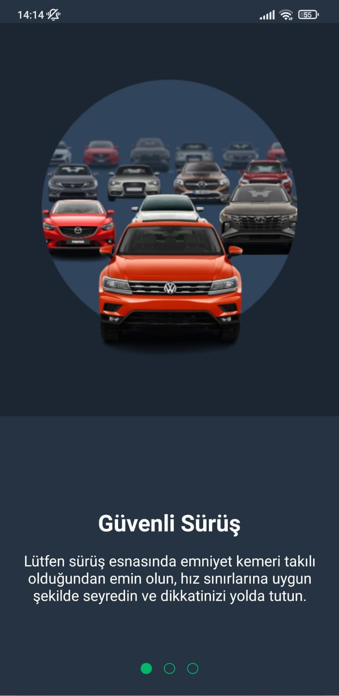
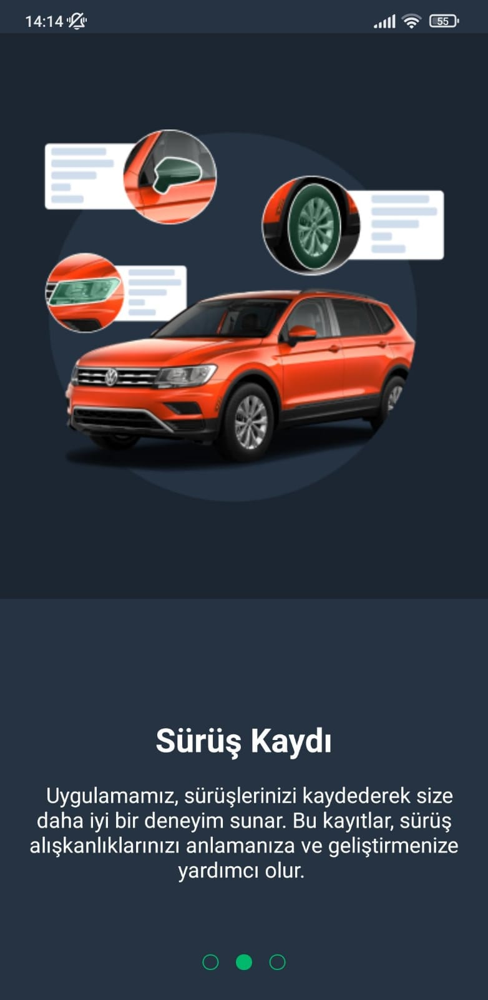
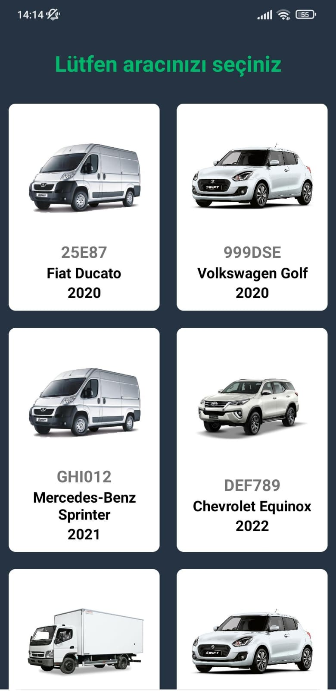
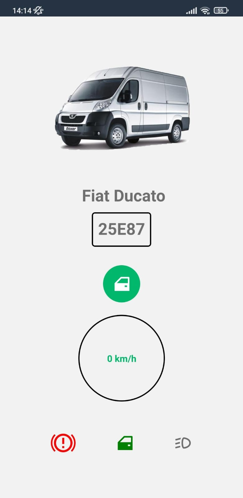
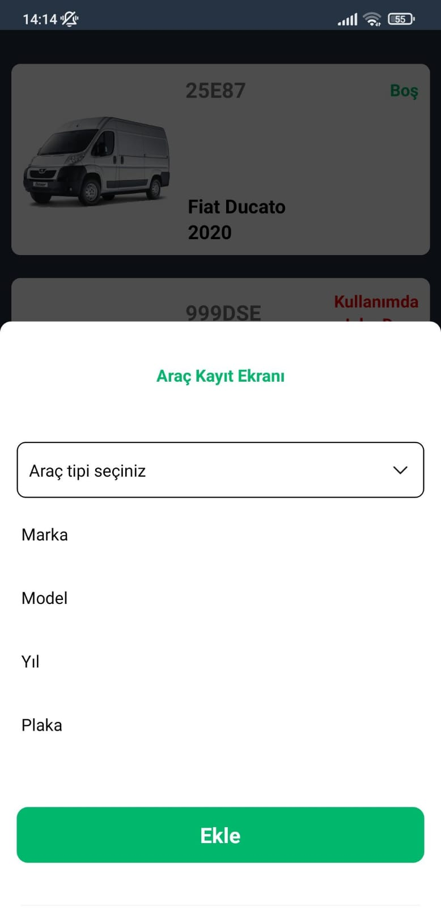

# ConnectCar

## Overview

**ConnectCar** is a mobile application that aims to improve the driving experience with advanced vehicle tracking and driver management features. Seamlessly integrates with Arduino-based hardware, enabling real-time transfer of important vehicle data to the app via Bluetooth. ConnectCar leverages the power of Firebase Authentication and Realtime Database to provide secure user authentication and streamlined data storage.

**Bluetooth Module Under Development**
I would like to inform you that the Bluetooth module is currently under development. I anticipate completing this module shortly and appreciate your patience. Stay tuned for the upcoming release!

## Project Preview

<div style="display: flex; flex-direction: row; justify-content: center;">
<div style="display: flex; flex-direction: row; margin-right: 20; margin-bottom: 10;">
    
  </div>
    <hr>
  <div style="display: flex; flex-direction: row; margin-right: 20; margin-bottom: 10;">
    
    
  </div>
    <hr>
  <div style="display: flex; flex-direction: row; margin-right: 20;margin-bottom: 10;"> 
    
     
  </div>
    <hr>
  <div style="display: flex; flex-direction: row; margin-right: 20;margin-bottom: 10;"> 
    
     
  </div>
  </div>

## Features

- **Vehicle Tracking:** Arduino-based hardware provides real-time data about the vehicle's status and location.
- **Driver Management:** ConnectCar facilitates efficient management of drivers, their profiles, and driving history.
- **Firebase Integration:** Utilizes Firebase for secure email-based login/logout and real-time database functionality.

## Technologies Used

- React Native: A widely-used JavaScript framework for building cross-platform mobile applications.
- Firebase: Firebase Authentication and Realtime Database services provide a robust and secure infrastructure.
- Arduino: Hardware integration for collecting real-time vehicle data.

## Getting Started

To run this project locally, follow these steps:

1. **Clone the repository:**

   ```bash
   https://github.com/AtakanAlkn/ConnectCar.git


   ```

2. **Navigate to the project directory:**

   cd ConnectCar.git

3. **Install dependencies:**

   npm install
   or
   yarn install

4. **Start the development server:**

   npm start
   or
   yarn start

5. **Run on iOS or Android:**

   To run the app on iOS or Android simulators/emulators, use the following commands respectively:

   npm run ios
   npm run android
   or
   yarn ios
   yarn android

**Congratulations!**
You've successfully set up and started the project locally. Feel free to explore the code, make changes, and test new features.

**Troubleshooting**
If you encounter any issues during the setup process or while running the app, consider the following steps:

Double-check that you've correctly configured your environment variables in the .env file.
Ensure you have Node.js and npm (or yarn) installed on your system.
Make sure you have Xcode (for iOS development) or Android Studio (for Android development) properly set up.
Clear the npm or yarn cache and node_modules directory, then run the installation step again.
If the problem persists, please open an issue on our GitHub repository. We'll be glad to assist you!

## License

This repository is licensed under the [MIT License](LICENSE).

## Contact

If you have any questions, suggestions, or just want to connect, you can reach me at:

- Email: alkan.atakan@outlook.com
- LinkedIn: [Atakan Alkan](https://www.linkedin.com/in/atakanalkn/)
